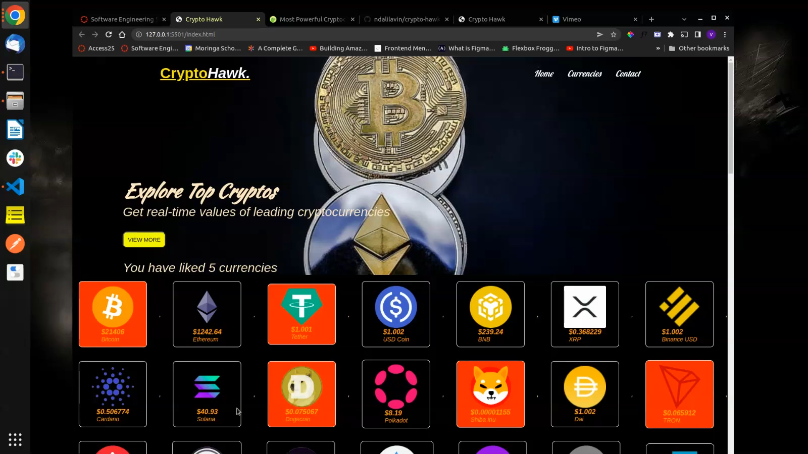

# Phase 1 Project: Crypto Hawk.
 ## Author: Vinson SN.
## Screenshot
 
 ## Table of Content
 - [Description](#description)
 - [Features](#features)
 - [Behaviour Driven Development](#Behaviour-Driven-Development)
 - [Requirements](#requirements)
 - [Installation Process](#installation-Process)
 - [Live Link](#Live-Link)
 - [Technology  Used](#technology-Used)
 - [Licence](#licence)
 - [Authors Info](#Authors-Info)
 ## Description
 
This project, in partial fulfillment of Phase 1 requirements, aims to create a website that displays the latest cryptocurrency market prices using HTML, CSS and JavaScript. An external API, [CoinGecko] (https://www.coingecko.com/en/api), is used to obtain real-time data of the respective cryptocurrencies.

## Features
As a user of the application,you will be able to:  
1. See a the live prices of the 6 major cryptocurrencies.  
2. Explore up to 30 major cryptocurrencies in the market.  
3. Like/favorite one or more cryptocurrencies.

[Go Back to the top](#)
## Behaviour Driven Development|
| Behaviour      | Input        | Output       |
| :------------- | :----------: | -----------: |
|  Enter your name  |   Vinson Ndalila |     |
| Enter your Email Address  | vndalila@gmail.com |   |
| Enter your message or comment   |  I would like to inquire about something     |     |
| Press Submit|     |Pop up "Vinson here, I have received your message. Thank you for reaching out.|
[Go Back to the top](#)
 ###  Requirements
 * Access to  a computer or any other garget
 * A modern web browser (preferably Google Chrome or Safari)
 * Access to internet
 ### Installation Process
 ****
* Clone to the repo : git clone https://github.com/ndalilavin/crypto-hawk.git
* Open the directory in a text editor
* Open the index file with any browser. 
    N/B: You will have to be connected to the internet for the API to work.
 ****
 [Go Back to the top](#)
### Live Link
- Click this link to view the live application https://ndalilavin.github.io/crypto-hawk/
### Technology  Used
* HTML - which was used to develop the structure off the pages.
* CSS - which was used to style the User Interface.
* JavaScript - which was used for DOM(Document Object Manipulation) scripts and implementing the API functionality.
[Go Back to the top](#)
## Known Bugs
* CSS bug on displaying the number of clicked items.
## Licence
MIT License
Copyright (c) [2022] [Vinson Ndalila]
Permission is hereby granted, free of charge, to any person obtaining a copy
of this software and associated documentation files (the "Software"), to deal
in the Software without restriction, including without limitation the rights
to use, copy, modify, merge, publish, distribute, sublicense, and/or sell
copies of the Software, and to permit persons to whom the Software is
furnished to do so, subject to the following conditions:
The above copyright notice and this permission notice shall be included in all
copies or substantial portions of the Software.
THE SOFTWARE IS PROVIDED "AS IS", WITHOUT WARRANTY OF ANY KIND, EXPRESS OR
IMPLIED, INCLUDING BUT NOT LIMITED TO THE WARRANTIES OF MERCHANTABILITY,
FITNESS FOR A PARTICULAR PURPOSE AND NONINFRINGEMENT. IN NO EVENT SHALL THE
AUTHORS OR COPYRIGHT HOLDERS BE LIABLE FOR ANY CLAIM, DAMAGES OR OTHER
LIABILITY, WHETHER IN AN ACTION OF CONTRACT, TORT OR OTHERWISE, ARISING FROM,
OUT OF OR IN CONNECTION WITH THE SOFTWARE OR THE USE OR OTHER DEALINGS IN THE
SOFTWARE.
[Go Back to the top](#)
## Authors Info
LinkedIn Name - Vinson SN.  
Email - vndalila@gmail.com / vinson.steve@student.moringaschool.com
